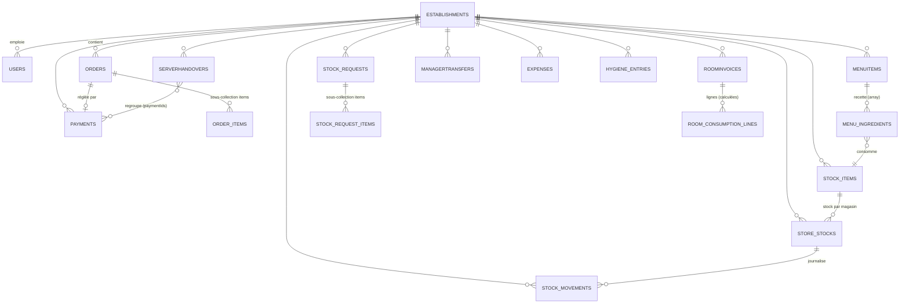

# TAKHOTEL (`takapp`) — Résumé technique

> Analyse factuelle du code au **2026-07-14**. Chaque affirmation importante cite un chemin de fichier (`fichier:ligne`).
> Périmètre analysé : dossier `lib/` (137 fichiers Dart, ~38 900 lignes) + configuration Firebase à la racine.
> Les fonctions Cloud (`createEstablishmentAdmin`, `notifyKitchenReady`, etc.) sont **appelées** mais leur code **n'est pas présent dans ce dépôt** (voir §6).

---

## 1. Vue d'ensemble

- **Objectif** : application de gestion d'établissement hôtelier/restauration au Bénin (Hôtel + Bar + Restaurant), pensée comme un **SaaS multi-établissements** avec facturation fiscale conforme DGI Bénin (e-MECeF / CertiLink). Description projet : `pubspec.yaml:2` (« Application de gestion d'Hotel »).
- **Nature** : application **Flutter cliente** (mobile Android + Web + Windows/desktop) branchée directement sur **Firebase** (pas de backend applicatif propre hormis des Cloud Functions).
- **Stack & versions** (`pubspec.yaml`) :
  - Dart SDK `^3.11.1` ; Flutter (Material 3).
  - `firebase_core ^4.7.0`, `firebase_auth ^6.4.0`, `cloud_firestore ^6.3.0`, `firebase_messaging ^16.1.3`, `cloud_functions ^6.1.0`.
  - État/DI : `provider ^6.1.5+1` (pattern Service + Controller `ChangeNotifier`).
  - Impression/PDF : `pdf ^3.12.0`, `printing ^5.14.3`.
  - Import/export : `excel ^4.0.6`, `excel2003 ^1.0.0`, `csv ^6.0.0`, `file_picker ^10.3.10`.
  - Divers : `shared_preferences`, `uuid`, `intl`, `flutter_local_notifications`.
  - **SDK local** : `certilink_flutter_sdk` via `path: ../../Certilink/certilink_flutter_sdk` (dépendance hors dépôt) — `pubspec.yaml:38-39`.
  - `http` est utilisé (`emcf_invoice_service.dart`, `fiscal_bridge_service.dart`) mais **n'est pas déclaré** dans `pubspec.yaml` (dépendance transitive uniquement).
- **Projet Firebase** : `takhotel-b0a4a` (`firebase.json`, `.firebaserc`), Firestore région `nam5`, hosting sur `build/web`.
- **Langue du code** : français (identifiants, commentaires, libellés UI).

---

## 2. Architecture

### Couches et patterns
Architecture en couches **Vue → Controller → Service → Firestore**, câblée par `provider` :

```
main.dart  (MultiProvider : injecte Services + Controllers)
   │
   ▼
Vue (StatelessWidget/StatefulWidget, lib/vues/**)
   │  context.watch/read<Controller>()
   ▼
Controller (ChangeNotifier, lib/controllers/**)   ── gère état UI (isLoading, errorMessage)
   │  appelle
   ▼
Service (lib/services/**)                          ── accès Firestore / Cloud Functions / HTTP
   │
   ▼
Firebase (Firestore, Auth, Functions, Messaging)
```

- Injection : `main.dart:77-147` (Providers, `ChangeNotifierProxyProvider` reliant Service→Controller).
- Certaines vues **court-circuitent** les Controllers et parlent à Firestore directement (ex. `global_admin_dashboard_page.dart:16`, `bar_stock_item_form_page.dart:39-44`, `reception_gerante_page.dart:161`). Le pattern n'est donc pas appliqué uniformément.
- **Navigateur global** : `core/app_navigator.dart` (clé `appNavigatorKey`, helpers push/resetTo pour logout/changement d'établissement).
- **Thème** : un seul thème clair Material 3, `core/themes/app_theme.dart` (bleu `#0D47A1` + or `#C9A227`). Pas de thème sombre.

### Flux d'une requête — exemple « le serveur crée une commande »
```
ServeurHomePage / NouvelleCommandePage
  → OrderController.submitOrder(...)                       controllers/order_controller.dart:138
  → OrderService.createOrder(...)                          services/order_service.dart:26
      • lit  establishments/{eid}/menuItems/{id}           (récupère la recette)
      • batch.set establishments/{eid}/orders/{orderId}    (statut 'sent', 'unpaid')
      • batch.set .../orders/{orderId}/items/{itemId}      (sous-collection)
      • StoreStockService.removeStockForOrder(...)          déduit le stock (mouvements 'out')
  → Cloud Function 'notifyKitchenReady' quand la cuisine passe 'ready'   services/cuisine_service.dart
```

### Point d'entrée / routage par rôle
- `main.dart:43` → init Firebase + Messaging + Notifications + Auth, puis `HomeRouter`.
- `vues/commun/home_router.dart` : **routeur applicatif basé sur le rôle** (pas de routes nommées). Selon `user.role`, affiche le dashboard correspondant (`global_admin`, `super_admin`/`proprietaire` → Owner, `gerante`, `comptable`, `chef_cuisine`, `serveur`, `barman`, `service_hygiene`/`majordhomme`). Redirige vers `UnauthorizedPage` si l'établissement est manquant ou le module refusé.

---

## 3. Multi-tenancy

### Stratégie réelle : **sous-collection par tenant** (isolation par chemin)
Le tenant est l'**établissement** (`establishments/{establishmentId}`). Créés/gérés par le `global_admin` : `global_admin_dashboard_page.dart:136-206` (champs `name, ifu, city, country, type, status, plan, modules{}`).

Presque **toutes** les données métier sont stockées en **sous-collections** sous `establishments/{establishmentId}/...`. L'isolation repose donc sur le **chemin du document**, pas sur un filtre `where('establishmentId')`. Confirmé sur l'ensemble des services :

| Donnée | Chemin |
|---|---|
| Commandes + lignes | `establishments/{eid}/orders` + `.../orders/{id}/items` — `order_service.dart:10-15,143` |
| Menu | `establishments/{eid}/menuItems` — `menu_service.dart:14-18`, `menu_admin_service.dart:18-20` |
| Paiements | `establishments/{eid}/payments` — `payment_service.dart:21-28` |
| Stock (référentiel / stock magasin / mouvements) | `.../stock_items`, `.../store_stocks`, `.../stock_movements` — `stock_item_service.dart:30`, `store_stock_service.dart:14,23` |
| Demandes de stock | `.../stock_requests` + `.../items` — `stock_request_service.dart:16-23` |
| Factures chambre | `.../roomInvoices` — `room_invoice_service.dart:16-18` |
| Versements serveur | `.../serverHandovers` — `handover_service.dart:26-28` |
| Transferts gérante→compta | `.../managerToAccountingTransfers` — `manager_transfer_service.dart:13-17` |
| Dépenses / soldes / clôtures | `.../expenses`, `.../accountOpeningBalances`, `.../accountClosures` — `comptabilite_service.dart`, `owner_dashboard_service.dart:158-161` |
| Hygiène quotidienne | `.../hygiene_daily_entries` + `.../items` — `hygiene_daily_service.dart:16-19,73` |
| Notifications serveur | `.../serverNotifications` — `server_notification_service.dart:14` |
| Config fiscale CertiLink (par tenant) | `.../certilink_config/config` — `certilink/services/certilink_config_service.dart:11-17` |
| Utilisateurs (staff) | `.../users` — `serveur_service.dart:14` |

### Résolution du tenant
- Pas de « middleware ». Le tenant est lu à la connexion depuis le doc utilisateur : `users/{uid}.establishmentId` → `UserModel.establishmentId` (`user_model.dart:107`, `auth_service.dart:99-106`).
- Il est ensuite **transmis explicitement** en paramètre à chaque appel de service (`AuthController.establishmentId`, `auth_controller.dart:24`). Aucune validation serveur ne garantit que ce paramètre correspond au tenant réel de l'utilisateur (voir points de vigilance).

### ⚠️ Points de vigilance (multi-tenancy)
1. **Le fichier `firestore.rules` versionné ne correspond pas au modèle de données réel.** Les règles ne définissent que des collections **racines** (`/orders`, `/menuItems`, `/payments`, `/stock_items`, `/roomInvoices`, `/hygiene_daily_entries`, `/expenses`, …) — `firestore.rules:88-289`. Il **n'existe aucune règle** pour `establishments/{eid}/...` (les chemins réellement utilisés), ni pour la collection `establishments` elle-même. En Firestore, tout chemin non couvert est **refusé par défaut** : soit les règles déployées diffèrent du dépôt (règles versionnées obsolètes/mortes), soit l'app serait bloquée. **État de sécurité serveur : indéterminé et non vérifiable depuis ce dépôt.**
2. **Aucune règle ne vérifie `establishmentId`.** Même les règles racines contrôlent uniquement le **rôle**, jamais l'appartenance au tenant (`firestore.rules:6-79`). L'isolation inter-tenants ne repose donc **que sur le client** (chemin construit correctement côté Flutter).
3. **`OrderController` code en dur un établissement unique** : `takhotelEstablishmentId = 'UYl0zamuxqrKOTw6K5DG'` (`order_controller.dart:12`). `submitOrder` **ignore** son paramètre `establishmentId` et écrit toujours sur ce tenant (`order_controller.dart:144,175` ; idem `addMenuItem` `:59`, et `notification_service_mobile.dart:395`). Un commentaire reconnaît la dette (`order_controller.dart:11`). → **Toute création de commande est mono-tenant**, contredisant le design SaaS.
4. **`BarService` utilise une collection racine `orders`** (`bar_service.dart:14-19`, `.where('establishmentId', ...)`) alors que les commandes sont écrites en sous-collection `establishments/{eid}/orders`. Le tableau de bord bar lit donc un jeu de données **différent (vide)** — voir §5.
5. **Certaines pages re-dérivent l'établissement de l'auth** au lieu du paramètre de route (`bar_stock_item_form_page.dart:33-37`, `cuisine_home_page.dart:76`), d'autres non : sources de vérité divergentes pour le tenant.

---

## 4. Modèle de données

### Entités principales (collections Firestore, préfixées `establishments/{eid}/`)



### Champs clés & énumérations (statuts réellement écrits)
- **OrderModel** (`order_model.dart`) : `clientType` (`restaurant|hotel|bar`), `status` (`sent|preparing|ready|served|cancelled` + runtime `stock_error`, `partially_cancelled`, `paid`), `kitchenStatus`/`barStatus` (`pending|preparing|ready|served|cancelled`), `paymentStatus` (`unpaid|partially_paid|paid`), `isForKitchen/isForBar`, `stockDeducted/stockRestored`, flags offline `pendingSync/syncError`. Lignes en sous-collection `items` (`OrderItemModel`, champ `targetDepartment` = `kitchen|cuisine|bar`, `isCancelled`).
- **MenuItemModel** (`menu_item_model.dart`) : `name, category, price, isAvailable, isForKitchen, isForBar, ingredients[]`. La recette (BOM) est un **array embarqué** de `MenuIngredientModel` (`itemId, itemName, store, unit, quantity`) reliant l'article à un `stock_item`.
- **Stock** : `StockItemModel` (référentiel, `store` ∈ `restaurant|bar|hotel|divers`, `isActive` = suppression logique) ; `StoreStockModel` (stock vivant : `quantity, reservedQuantity, minimumQuantity, isLowStock`, `availableQuantity = quantity - reserved`) ; `StockMovementModel` (`movementType` déclaré `in|out|transfer|adjustment|cancellation_restore` mais **seuls `in`/`out` sont écrits**).
- **StockRequestModel** : `status` déclaré `pending|approved|delivered|received|rejected|cancelled`, **seuls `pending|delivered|received` utilisés**.
- **PaymentModel** (`payment_service.dart:135-156`) : `orderId, method, amount, status='confirmed', handoverStatus (none|pending|declared|validated), type, isFiscalized`.
- **ServerHandoverModel** : `serveurId, declaredAmount, paymentIds[], status (pending|partially_validated|validated|rejected)`, `validatedPaymentIds/rejectedPaymentIds`.
- **RoomInvoiceModel** (`room_invoice_service.dart`) : facture chambre persistée, `status`, `isFiscalized`, `fiscalStatus (pending|success|failed)`, `mecefCode, nim, qrCode, counters`.
- **UserModel** (`user_model.dart`) : `uid, establishmentId, establishmentName, name, email, phone, role, isActive, modules{restaurant,bar,hotel,stock,fiscalization}`.
- **Comptabilité** : `ExpenseModel` (`label, category, accountType, amount`), `AccountBalanceModel` (`type, amount, date`), `ManagerTransferModel` (`amount, status pending|received, managerId, receivedByAccounting*`), clôtures `accountClosures` (`theoreticalAmount, physicalAmount, difference, validated`).

### Index Firestore (`firestore.indexes.json`)
- 25 index composites, **portée `COLLECTION`** sur les identifiants `orders, menuItems, payments, roomInvoices, serverHandovers, stock_items, managerToAccountingTransfers, serverNotifications` (une portée COLLECTION s'applique à toute collection de cet ID, y compris les sous-collections par établissement).
- Contient des index pour des collections **`reservations`** et **`searchInvoice`** (`firestore.indexes.json:229,309`) qui **n'ont aucun code** correspondant (voir §5, module Hôtel).
- Aucun index n'inclut `establishmentId` (cohérent avec l'isolation par chemin).

---

## 5. Modules fonctionnels

Légende : ✅ terminé & câblé · 🚧 partiel/incohérent · ❌ absent.

| Module | Statut | Détails & fichiers |
|---|---|---|
| **SaaS / Admin global** (établissements, plans, modules, création admin) | ✅ | CRUD établissements + activation modules + création du 1er admin via Cloud Function. `vues/global_admin/global_admin_dashboard_page.dart` |
| **Auth & session** | ✅ | Firebase Auth email/mdp, reset par email, garde « établissement rattaché », déconnexion globale. `services/auth_service.dart`, `controllers/auth_controller.dart`, `vues/auth/login_page.dart` (suggestions d'emails en `SharedPreferences`) |
| **Commande serveur (Restaurant)** | ✅ (logique) / 🚧 (tenant) | Panier, calcul, création, annulation partielle/totale avec restitution stock. **Mais** établissement codé en dur (`order_controller.dart:12`). `services/order_service.dart`, `controllers/order_controller.dart`, `vues/serveur/*` |
| **Cuisine** | ✅ | Tableau kitchen, transitions de statut, notif « prêt » (Cloud Function `notifyKitchenReady`). Chemin sous-collection correct. `services/cuisine_service.dart`, `vues/cuisine/cuisine_home_page.dart` |
| **Bar** | 🚧 **cassé** | UI complète mais `BarService` lit/écrit la collection **racine** `orders` au lieu de `establishments/{eid}/orders` → n'affiche aucune commande créée par le flux normal. `services/bar_service.dart:14-19`, `vues/bar/bar_home_page.dart` |
| **Menu & recettes** | ✅ | Gestion menu (CRUD, import CSV/Excel, disponibilité), recettes cuisine & bar. `services/menu_admin_service.dart`, `menu_ingredient_service.dart`, `vues/gerante/gestion_menu_page.dart`, `vues/cuisine|bar/*_ingredients_form_page.dart` |
| **Stock** (référentiel, stock magasin, mouvements, seuils, ruptures) | ✅ | Déduction auto sur commande, restitution sur annulation, appro direct, seuil mini, alertes rupture. `services/store_stock_service.dart`, `stock_item_service.dart`, `vues/shared/*` |
| **Demandes / transferts de stock** | 🚧 | Workflow `pending → delivered → received` fonctionnel, **mais** la « livraison » **ajoute** du stock à la destination sans **déduire** d'une source : c'est un approvisionnement, pas un vrai transfert (aucun mouvement `transfer`). `services/stock_request_service.dart:218-277` |
| **Paiement / encaissement** | ✅ | Enregistre paiement (garde cuisine/bar « prêt »), passe commande `paid`, gère `roomExtras` si imputé chambre. `services/payment_service.dart` |
| **Versement serveur → gérante** (handover) | ✅ | Deux phases : déclaration serveur puis validation/rejet gérante par paiement. `services/handover_service.dart`, `gerante_handover_service.dart`, `vues/serveur/versement_gerante_page.dart`, `vues/gerante/versements_serveurs_page.dart` |
| **Transfert gérante → comptable** | ✅ | Envoi montant + confirmation réception comptable. `services/manager_transfer_service.dart`, `vues/gerante/versement_compta_page.dart` |
| **Comptabilité** (dépenses, soldes d'ouverture, point hebdo, clôtures) | ✅ | Résumé hebdo = entrées − dépenses + soldes d'ouverture ; rapprochement théorique/physique. `services/comptabilite_service.dart`, `owner_dashboard_service.dart`, `vues/comptabilite/*` |
| **Dashboard propriétaire** (analytics/soldes) | ✅ | Soldes théoriques par type de compte, validation soldes physiques. `services/owner_dashboard_service.dart`, `vues/owner/owner_dashboard_page.dart` |
| **Hygiène / Majordome** (préparation chambre + consommation stock hôtel) | ✅ | Entrée quotidienne par chambre déduisant le stock `hotel`. `services/hygiene_daily_service.dart`, `vues/hygiene/*` |
| **Facturation chambre & fiscalisation** | ✅ | Factures `roomInvoices` persistées + cycle de fiscalisation (pending/success/failed). `services/room_invoice_service.dart`, `controllers/fiscalization_controller.dart`, `vues/gerante/facturation_chambre_page.dart` |
| **Consommation chambre (agrégation)** | 🚧 | Agrège les commandes hôtel en lignes de facture **en mémoire uniquement** — jamais persistée ni fiscalisée ; `RoomConsumptionInvoiceModel.toMap` est du code mort. `services/room_consumption_service.dart` |
| **Fiscalisation DGI (e-MECeF / CertiLink)** | 🚧 | **CertiLink SDK = voie active** (`fiscalization_controller.dart:46-104`), credentials `tenantId/apiKey` stockés **par tenant dans Firestore** (`certilink_config/config`), pas dans le code. Voie directe **e-MECeF** (`emcf_invoice_service.dart` + `config/emcf_config.dart`) et **bridge local** `http://127.0.0.1:8787` (`fiscal_bridge_service.dart`) = **code mort** (jamais instancié) qui embarque néanmoins le token DGI en dur. |
| **Notifications** (FCM + notifications serveur in-app) | ✅ | Import conditionnel web/mobile (`notification_service.dart`), listener temps réel des `serverNotifications`. |
| **Impression / PDF** | ✅ | `services/pdf_service.dart` (905 l.), `printer_service.dart`. |
| **Enregistrement serveur (staff)** | 🚧 | Crée seulement un doc Firestore `users` — **aucun compte Firebase Auth** provisionné (pas de mot de passe). `services/serveur_service.dart` |
| **Hôtel : réservations / check-in / check-out** | ❌ **Non implémenté** | Aucun modèle/service/contrôleur `reservation`/`checkIn`. Seuls subsistent des index Firestore `reservations`/`searchInvoice` orphelins (`firestore.indexes.json:229,309`). L'« Hôtel » se limite à la facturation chambre + consommation + hygiène. |
| **Mode hors-ligne / sync** | ❌ | Champs `pendingSync`/`syncError` présents partout mais **jamais exploités** (toujours `false`, aucune file de synchro). |

---

## 6. « API » : surface d'intégration

Il n'y a **pas d'API REST propre**. La surface se compose de : (a) collections Firestore régies par les règles, (b) Cloud Functions callables, (c) API HTTP externes.

### (a) Firestore — autorisations *(telles que définies dans le `firestore.rules` versionné, qui porte sur les collections racines — voir avertissement §3.1)*

| Collection (règles) | Lecture | Création | Écriture/MàJ | Suppression |
|---|---|---|---|---|
| `users` (`:80`) | soi-même | soi / admin / gérante | idem | admin/propriétaire |
| `menuItems` (`:88`) | connecté | admin/gérante | admin/gérante ; chef (ingredients seulement) | admin/gérante |
| `orders` + `items` (`:102`) | connecté | serveur/gérante/admin | serveur/gérante/chef/barman/admin | admin/gérante |
| `payments` (`:138`) | connecté | serveur/gérante/admin | serveur/gérante/admin | admin/gérante |
| `serverHandovers` (`:152`) | connecté | serveur/gérante/admin | gérante/comptable/admin | admin/gérante |
| `managerToAccountingTransfers` (`:163`) | connecté | gérante/comptable/admin | idem | admin |
| `roomInvoices` (`:171`) | serveur/gérante/admin | idem | idem | admin/gérante |
| `stock_items` / `store_stocks` / `stock_movements` / `stock_requests` (`:178-244`) | selon rôle+magasin (`canReadStore`) | `canManageStore` | `canManageStore`/gérante | admin/gérante |
| `hygiene_daily_entries` (`:246`) | gérante/hygiène/admin | idem | gérante/admin | gérante/admin |
| `accountOpeningBalances` / `accountClosures` / `expenses` (`:270-289`) | gérante/comptable/admin | idem | idem | admin |
| `serverNotifications` (`:291`) | admin/gérante/serveur(propre) | admin/gérante/chef/barman | serveur : `isRead/readAt` seulement | admin/gérante |

> Rappel : ces règles **ne couvrent pas** `establishments/**` (le chemin réel des données) et **n'imposent aucun `establishmentId`**.

### (b) Cloud Functions callables (déployées hors dépôt)
| Fonction | Région | Appelée depuis |
|---|---|---|
| `createEstablishmentAdmin` | us-central1 | `global_admin_dashboard_page.dart:64,153` |
| `createTenantUser` | (via `instanceFor`) | `owner_dashboard_page.dart` (création staff) |
| `notifyKitchenReady` | — | `cuisine_service.dart:108` |
| `notifyBarReady` | — | `bar_service.dart:89` |

### (c) API HTTP externes
- **DGI Bénin SYGMEF/e-MECeF** : `config/emcf_config.dart` (`developper.impots.bj` test / `sygmef.impots.bj` prod).
- **CertiLink** : via `certilink_flutter_sdk` (`CertiLinkClient(tenantId, apiKey)`), `certilink/services/certilink_certification_service.dart`.
- **Bridge fiscal local** : `http://127.0.0.1:8787/print-invoice` (`fiscal_bridge_service.dart:11`) — imprimante/dispositif fiscal desktop.

---

## 7. Conventions de code observées

- **Langue** : tout en français (classes, méthodes, commentaires, messages). Dossiers en français (`vues`, `modeles`).
- **Nommage** : classes `PascalCase` ; fichiers `snake_case` ; suffixes explicites `*_model.dart`, `*_service.dart`, `*_controller.dart`, `*_page.dart`.
- **Modèles** : classes immuables (`final` + constructeur `const`), avec `fromMap(map, id)` / `toMap()` / `copyWith()`, et helpers de coercion défensifs (`toDouble`, `toDateTime`) tolérant les types Firestore.
- **Services** : `FirebaseFirestore.instance` en champ ; helper privé construisant le `CollectionReference` sous `establishments/{eid}/...` ; validation `establishmentId` non vide qui `throw Exception('Établissement introuvable.')`.
- **Controllers** : `ChangeNotifier` exposant `isLoading/isSubmitting` + `errorMessage`, `notifyListeners()` après chaque étape.
- **Écritures** : usage de `WriteBatch` pour l'atomicité (commande+lignes+stock), `FieldValue.serverTimestamp()` pour les dates, champs d'audit systématiques (`createdBy/createdByName/createdAt/updatedAt`) + `pendingSync/syncError`.
- **Constantes centralisées** : `core/constants/app_roles.dart`, `account_types.dart`, `app_payment_methods.dart` (avec libellés FR + mapping module→autorisation).
- **Blocs de commentaires décoratifs** `// =====` très présents ; lint = `flutter_lints` par défaut (`analysis_options.yaml`, aucune règle custom).

---

## 8. État d'avancement

**Ce qui fonctionne (mono-établissement) :**
- Cycle commande complet Restaurant/Cuisine : création → cuisine (prêt) → encaissement → versements → comptabilité, avec **gestion de stock automatique** (déduction/restitution basée recette).
- Facturation chambre + fiscalisation CertiLink, comptabilité (dépenses, soldes, point hebdo, clôtures), hygiène, notifications temps réel, PDF/impression.
- Console SaaS d'administration des établissements et des modules.

**Incomplet / incohérent :**
- **Bar cassé** : mauvais chemin de collection (`bar_service.dart`).
- **Mono-tenant en dur** dans le flux commande (`order_controller.dart:12`).
- **Consommation chambre** non persistée (agrégation mémoire seulement).
- **Transfert de stock** = approvisionnement (pas de déduction source).
- **Enregistrement serveur** sans compte Auth.
- **Réservations hôtelières & check-in/out : absentes.**
- **Sync offline** : ébauche de champs sans implémentation.

---

## 9. Dettes techniques & risques

### 🔴 Sécurité — critiques
1. **Secret DGI en dur dans le dépôt** : `config/emcf_config.dart:24,27` contient un **IFU vendeur** et un **token JWT Bearer DGI** en clair (committé). À révoquer/retirer même si la voie e-MECeF est legacy. `useTestServer = true` (`:15`) : la prod nécessite un changement de code (pas de config d'environnement).
2. **Règles Firestore désalignées** (§3.1) : le `firestore.rules` versionné ne protège aucun chemin `establishments/**` (données réelles) et n'impose jamais `establishmentId`. L'isolation inter-tenants n'est **pas garantie côté serveur** dans ce dépôt → risque de fuite de données entre établissements si les règles déployées ne compensent pas.
3. **Confiance client pour le tenant** : `establishmentId` est un paramètre fourni par le client, non revalidé par les règles.

### 🟠 Correction / cohérence
4. **`bar_service.dart:14-19`** lit la collection racine `orders` (le tableau bar ne verra jamais les commandes) — bug fonctionnel.
5. **`order_controller.dart:12,59,175`** : établissement codé en dur `UYl0zamuxqrKOTw6K5DG` (mono-tenant).
6. **Trois chemins mutant `handoverStatus`** (`handover_service`, `gerante_handover_service`, écriture directe `reception_gerante_page.dart:161`) → risque d'incohérence.
7. **Taxonomie des types de compte divergente** : `AccountTypes.bankTransfer = 'bank_transfer'` (`account_types.dart:12`) vs `OwnerDashboardService` normalise vers `'banque'` (`owner_dashboard_service.dart:39`). Risque d'agrégations partielles.
8. **Incohérences de champs à la création** de `stock_items` selon la page (`cuisine/stock_item_form_page.dart:65-74` omet `pendingSync/syncError/isDeleted/createdBy`).
9. **`stock_item_registry_page.dart:34`** exclut le magasin `divers` pourtant supporté par le modèle.

### 🟡 Qualité / maintenance
10. **Aucun test** (pas de dossier `test/`) et **aucun CI/CD** (pas de `.github/`).
11. **Code mort** : services `emcf_invoice_service.dart` et `fiscal_bridge_service.dart` **jamais instanciés** (mais compilés, embarquant le token) ; `OwnerDashboardSummaryModel` défini mais non peuplé ; `RoomConsumptionInvoiceModel`/`RoomConsumptionLineModel.toMap`, `KitchenOrderModel.toMap` ; énumérations de statut déclarées mais jamais écrites (`transfer`, `adjustment`, `approved`, `rejected`, `cancelled`…) ; index Firestore orphelins (`reservations`, `searchInvoice`).
12. **Logs de debug laissés** : ~26 appels `print(...)` dans 7 fichiers (dont identifiants d'emails en clair, `login_page.dart:57,85,188`).
13. **~49 `withOpacity(...)`** (API dépréciée dans les Flutter récents).
14. **`http` non déclaré** dans `pubspec.yaml` (utilisé mais seulement transitif).
15. **Dépendance hors dépôt** : `certilink_flutter_sdk` en `path: ../../Certilink/...` (build non reproductible hors poste dev).
16. **`README.md`** encore le template Flutter par défaut.
17. **Pas de séparation d'environnements** (test/prod pilotés par des constantes en dur).
18. **Recherche factures inefficace** : `room_invoice_service.dart:190-252` télécharge toute la collection `roomInvoices` puis filtre en mémoire (`contains`) à chaque recherche.
19. **Deux mécanismes de réception concurrents** côté comptable : flip de statut simple (`ComptabiliteService.confirmTransferReception` / `ManagerTransferService.confirmReception`) vs. batch en cascade dans `reception_gerante_page.dart:98-168` (met aussi à jour `serverHandovers`, `roomInvoices`, `payments`). Risque d'incohérence.
20. **Modèle vs writer désalignés** : `ManagerTransferModel` déclare `handoverId/serveurId/serveurName` que `ManagerTransferService.sendToAccounting` n'écrit jamais.
21. **Clés Firebase committées** (`firebase_options.dart:50,60,68`) — clés client standard (non strictement secrètes) mais présentes dans l'arbre.

---

## 10. Prochaines étapes recommandées (priorisées)

1. **Révoquer et retirer le token JWT DGI** de `emcf_config.dart` ; purger l'historique git ; externaliser secrets/IFU par établissement (déjà le modèle CertiLink par tenant). *(Sécurité, immédiat.)*
2. **Réécrire `firestore.rules` pour le modèle réel** : régir `establishments/{eid}/**`, et imposer que `establishmentId` du chemin == `establishmentId` du doc utilisateur appelant (`get(users/$(uid)).data.establishmentId`). Ajouter des tests de règles (émulateur). *(Sécurité, critique.)*
3. **Corriger le multi-tenant du flux commande** : supprimer `takhotelEstablishmentId`, propager `AuthController.establishmentId` dans `OrderController`/`OrderItemModel`/notifications.
4. **Corriger `BarService`** pour lire/écrire `establishments/{eid}/orders` (aligné sur cuisine) ; vérifier de bout en bout le tableau bar.
5. **Unifier la mutation des `handoverStatus`** dans un seul service ; supprimer l'écriture directe en page.
6. **Décider de la voie fiscale** : conserver CertiLink, retirer le code e-MECeF direct + bridge local s'ils sont abandonnés (ou les isoler derrière un flag propre).
7. **Implémenter (ou retirer) le module Hôtel manquant** : réservations + check-in/out, ou nettoyer les index/écrans qui le sous-entendent.
8. **Persister la facture de consommation chambre** ou supprimer le code mort associé ; corriger le « transfert » de stock (déduction source).
9. **Provisionner un vrai compte Auth** à l'enregistrement d'un serveur (Cloud Function `createTenantUser`).
10. **Fondations qualité** : ajouter des tests (unitaires services + règles), un pipeline CI (`flutter analyze` + `flutter test`), remplacer les `print` par un logger, corriger les `withOpacity`, déclarer `http`, rédiger un vrai `README`.
11. **Implémenter réellement la synchro offline** (ou retirer les champs `pendingSync/syncError`).

---

*Fin du résumé. Toutes les observations sont issues de la lecture du code (aucun fichier existant n'a été modifié).*
